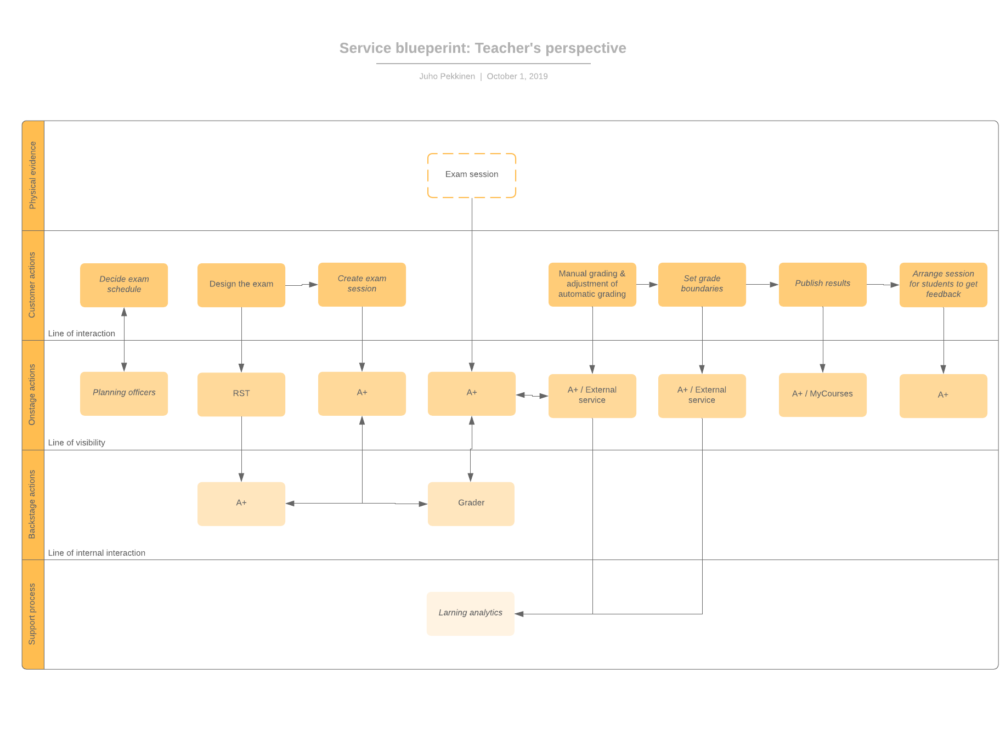
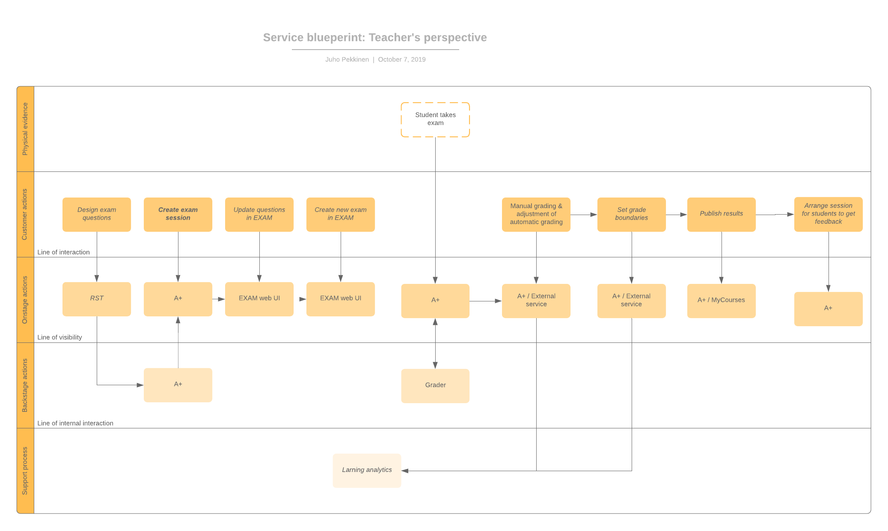

Electrical Exam Documentation
=============================

This documentation describes the functionalities added to the A+ system
for electrical examination during Summer 2019 by a few summer workers.

Table of contents
-----------------

* [Exammode app](#exammode-app)
* [Exam Management Page](#exam-management-page)
* [Selection of Exam Templates](#selection-of-exam-templates)

Exammode app
------------

The exammode app is the bread and butter of the designed electrical exam system. 

An exam session is the basic unit for the system and all  features of the system are linked to one session and can be accessed by viewing that session. These features are

For students:

* See exam dates and locations
* Request translation of  exam
* Request accelerated grading and reporting of results
* See feedback for the exam
* Request additional information on grading

For teachers:

* Manage exam sessions
* Grade exams and API to other grading services
* Set grade boundaries
* Manage student requests

For detailed description of what requirements each feature should meet, check [use cases](UseCases.md)

The overall design of the system is based on a process that is depicted in following service blueprints.

Creating an exam
----------------

For instructions how to use Exam classes see their [wiki](https://wiki.aalto.fi/display/OPIT/Exam+workflow).

For first time only:
* Create new git branch for exam (is this necessary?)
* Ask A+ admins to create new mooc grader and hook new branch to that grader
* Ask exam admins to create new course to exam A+ and set it to use grader created above
* In the new branch, create new folder with index.rst files for the exam
* Edit master index so that only exam module indices are listed
* Possible, create new master index and conf.py file pointing to that index

For each exam:
* Create new rst files for the exam (one for each language version), name files appropriately e.g. exam_yyyymmdd_fi.rst. This represents a 'exam sheet'
* Adjust exam module index.rst so that only files made in previous step are listed
* Adjust module opening times accordingly
* For exam specific exercises, create them directly to the exam branch to a suitable location, e.g. module_exam/exercises/
* Add exam questions to the 'exam sheet' with a include directive. You can use either specific exam questions or regular exercises used during the course
* Rebase to the master / production branch whenever you want to use newer exercises
* Push your changes to the remote and check tentit.cs.aalto.fi that everything works as intended

Questions:
* What to do if there are several exams going on at the same time or close to each other
* Do unlisted questions mess the total points?
* Can students have access to exam questions (unlisted module) after exam?
* Can exam questions become available to students after certain DL?

### Models

* ExamSession

	`ExamSession` class is responsible for a single exam session.
	`ExamSession` includes the details of a single exam.

	* `course_instance`
		The course for the exam.

	* `exam_module`
		The exam. The exam is currently a single A+ module.

	* `room`
		The physical room, where the exam is held.

	* `active_exams`
		Active `ExamAttempt`(s) for the a particular `ExamSession`

	* `can_start`
		When the exam is initially planned to begin, e.g. 12.00.

	* `start_time_actual`
		When the exam actually started, e.g. 12.04.

* ExamAttempt

	`ExamAttempt` class is responsible for a single exam attempt by a single student.

	* `exam_taken`
		The `ExamSession` that the student is attempting.

	* `student`
		The `UserProfile` that is taking the exam.

	* `exam_started`
		The time when the student started the exam.

	* `exam_finished`
		When student finishes the exam.

	* `system_identifier`
		The indentifier for the machine that is used to do the exam.

### Views

Many views are same as in `exercise` views, but a few are added for new detail pages for the exam.

* ExamStartView

	This view is initially shown to the student and it shows a list of all available exams to the student.
	By clicking on the correct exam, it will direct student to `ExamDetailView`. Uses the template
	`exam_start.html`.

* ExamDetailView

	Shows details of a single exam. It includes all the details that are unique for that specific exam.
	Uses the template `exam_detail.html`. The view is able to deduce the template name without `template_name`
	parameter, this is a feature in Django.

### Templates

The templates have had many changes, since in exam mode we need to disable many links
and the UI should be as simple as possible.

* `exammode/base.html`

	This is the base template for exammode and it is a custom version of `templates/base.html`.
	This is set in 'exercises/views.py'file. The main modifications include removing the user menu on the left side of the page
	and displaying just the language selection, student ID and user name on the page header.

* `exammode/examsession_detail.html`

	Used by the `ExamDetailView`.

* `exammode/exam_start.html`

	Used by the `ExamStartView`.

* `exammode/exam.html`

	This is the exam template that is shown when the student is on the exam page.
	The template is created by combining `exercise/exercise_base.html` and
	`exercise/exercise.html` together and making necessary modifications for exam page.
	The reason to combine them was to make the templates a bit more readable, since in exam the templates are simpler.
	So it is not necessary to split them like they are in `exercise`.

* `exammode/exam_question.html`

	This is the template for a single question. The questions are wrapped in Bootstrap panels and this is wrapping is done in this template.
	The template is a custom version of `exercise/exercise_plain.html`.
	The exercise is also split into two columns in the exam version.
	The splitting is achieved in `static/exammode/js/exam.js` with the help of Bootstrap's grid system.

Exam Management Page
--------------------

Exam management page was added to A+ to create, edit and delete ExamSessions.
It is found in course menu by the course staff.

### Additions to `exercise/staff_views.py`

* ExamManagementView
	The main page for the exam management tool. It uses the `exammode/staff/exam_management.html` template.
	New exam sessions are created on this view.

* ExamSessionEdit
	View to the edit an existing Examsession. It uses the `exammode/staff/edit_session_form.html` template.
	Uses the Django built-in generic view `UpdateView` as superclass.

* ExamSessionDelete
	View to the delete an existing Examsession.
	It handles the deletion of a ExamSession inside the ExamManagementView page.
	Before the ExamSession is deleted, there is a confirmation page, which is rendered with the `examsession/examsession_confirm_delete.html` template.
	After deletion the user is simply redirected to ExamManagementView.

Urls are handled in `exercise/urls.py`.

### Templates

Exam managegement page uses the templates `exammode/staff/exam_management.html`, `exammode/staff/edit_session_form.html`
and `exammode/staff/edit_session_form.html`.
Their usage is explained above in section `Additions to exercise/staff_views.py`.

Selection of Exam Templates
---------------------------

The exam mode should be used together with the current A+, thus there needs to be a way to switch between the modes.
The exam templates should be selected based on the current mode, which could be the current (normal) mode,
exam mode or even the mobile mode that may be implemented later.

### Choosing templates in ExerciseView

Currently the templates are selected in `ExerciseView` class that is found in `exercise/views.py`.
The logic is to select the exam mode templates if the `userprofile` that is making the request
has ongoing `active_exam` and then the pages are rendered with the exam mode templates.
